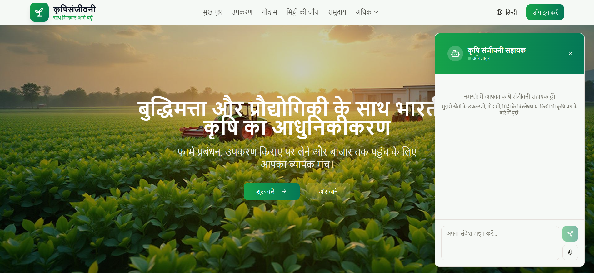
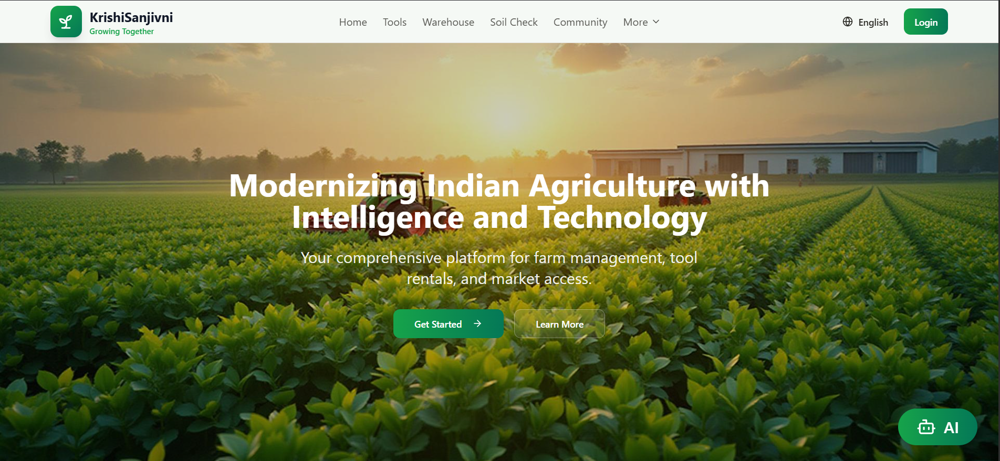
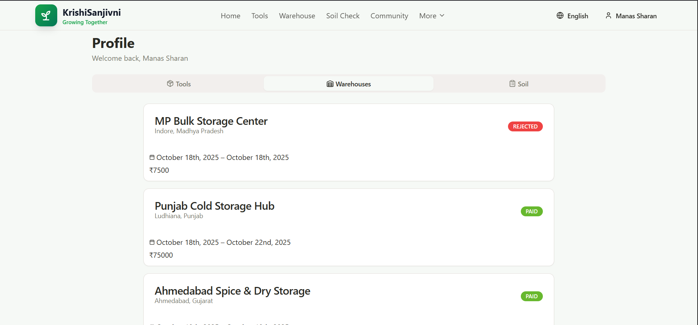
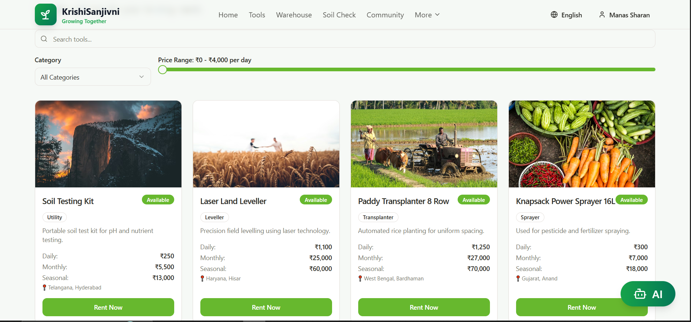
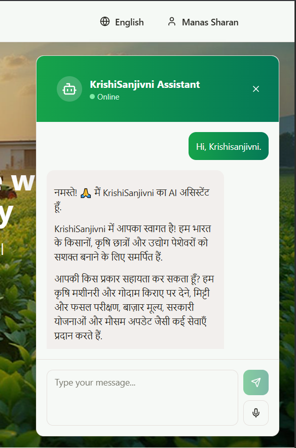
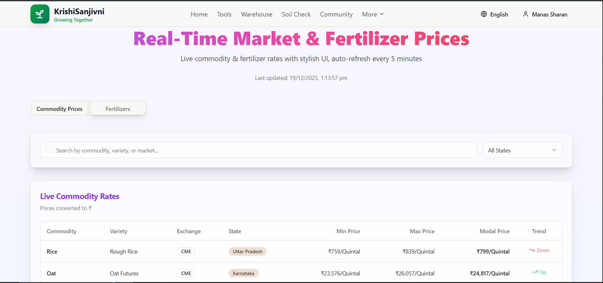
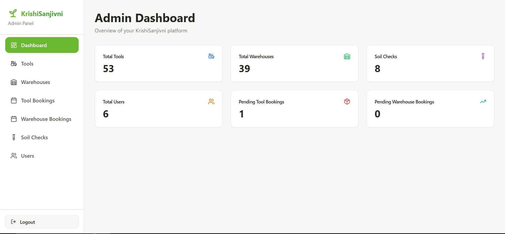
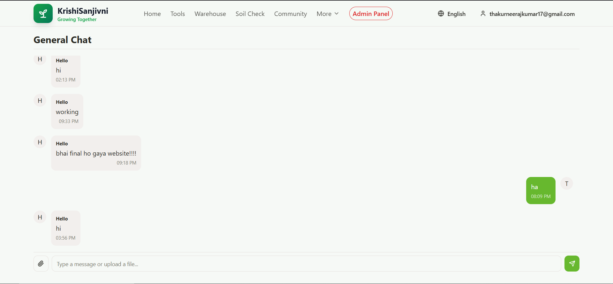
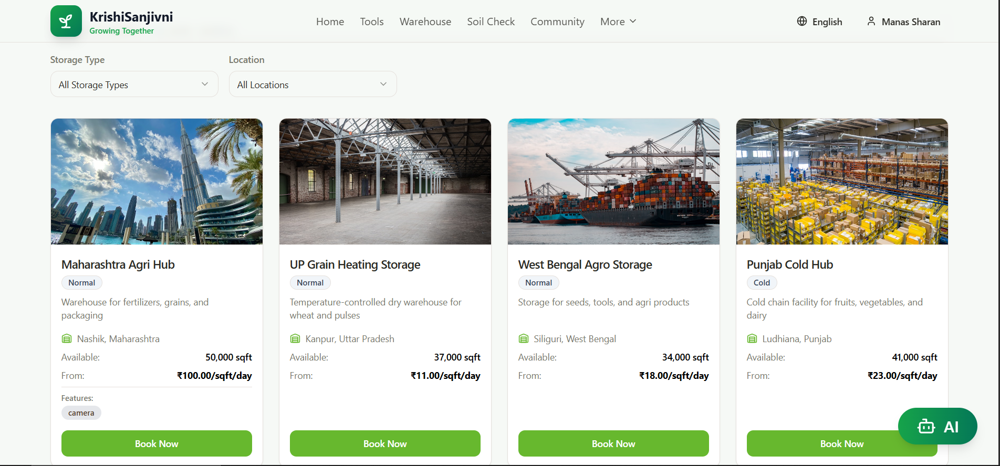
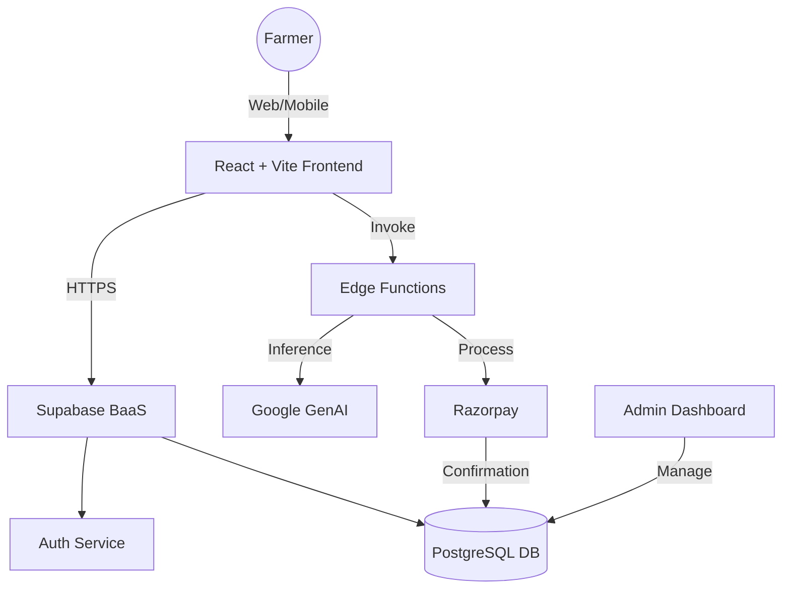

<div align="center">
  <a href="https://github.com/Neerajkumar151/KrishiSanjivni">
    
  </a>

  <h1 align="center">🌱 KrishiSanjivni</h1>

  <p align="center">
    <strong>Empowering Farmers with Digital Intelligence & AI</strong>
    <br />
    A comprehensive smart farming platform for soil testing, equipment rentals, real-time insights, and community connection.
    <br />
    <br />
    <a href="https://krishisanjivni.vercel.app/"><strong>Visit Website »</strong></a>
    <br />
    <br />
    <a href="https://github.com/Neerajkumar151/KrishiSanjivni/issues">Report Bug</a>
    ·
    <a href="https://github.com/Neerajkumar151/KrishiSanjivni/issues">Request Feature</a>
  </p>
</div>

<div align="center">
  
  
  
  
</div>

---

<details>
  <summary><strong>📖 Table of Contents</strong></summary>
  <ol>
    <li><a href="#-overview">Overview</a></li>
    <li><a href="#-tech-stack">Tech Stack</a></li>
    <li><a href="#-video-demo">Video Demo</a></li>
    <li><a href="#-screenshots">Screenshots</a></li>
    <li><a href="#-system-architecture">System Architecture</a></li>
    <li><a href="#-key-features">Key Features</a></li>
    <li><a href="#-getting-started">Getting Started</a></li>
    <li><a href="#-project-structure">Project Structure</a></li>
    <li><a href="#🗺️-future-roadmap">Future Roadmap</a></li>
    <li><a href="#-contact">Contact</a></li>
  </ol>
</details>

---

## 🚀 Overview

**KrishiSanjivni** is a digital ecosystem designed to bridge the gap between traditional farming and modern technology. By integrating AI, real-time data, and e-commerce, we aim to reduce manual effort and improve decision-making for farmers across India.

### 🎯 Goal
To democratize access to agricultural services—from soil testing to equipment rentals—in a language the farmer understands.

---

## 🛠 Tech Stack

The project is built using a modern, scalable architecture.

| Component | Technologies |
| :--- | :--- |
| **Frontend** |     |
| **UI Components** | Radix UI, Shadcn/UI, Recharts (Charts) |
| **Backend / DB** |  (Auth, DB, Edge Functions) |
| **AI / ML** |  (Chatbot, Speech-to-Text) |
| **Payments** |  |
| **Localization** | i18next (Hindi, English, Tamil, Telugu, Bengali) |

---

## 🎥 Video Demo

Click below to watch a complete walkthrough of the platform in action:

[](./public/assets/demo.mp4)

---

## 📸 Screenshots

<table>
  <tr>
    <td align="center" width="50%">
      
      <br><strong>🏠 Landing Page</strong>
    </td>
    <td align="center" width="50%">
      
      <br><strong>👤 Farmer Profile</strong>
    </td>
  </tr>
  <tr>
    <td align="center" width="50%">
      
      <br><strong>🚜 Equipment Rental</strong>
    </td>
    <td align="center" width="50%">
      
      <br><strong>🤖 AI Chatbot (Voice Enabled)</strong>
    </td>
  </tr>
  
  <tr>
    <td align="center" width="50%">
      
      <br><strong>💹 Real-time Mandi Prices</strong>
    </td>
    <td align="center" width="50%">
      
      <br><strong>🛡️ Admin Panel</strong>
    </td>
  </tr>
  <tr>
    <td align="center" width="50%">
      
      <br><strong>👥 Community Page</strong>
    </td>
    <td align="center" width="50%">
      
      <br><strong>🏪 Warehouse Booking</strong>
    </td>
  </tr>
</table>

---

## 🏗 System Architecture

We utilize a serverless architecture powered by Supabase Edge Functions to ensure scalability and low latency.
Below is the architecture that powers the platform:



---

## ✨ Key Features
### 1. 🌾 Smart Farming Services
  - Soil & Crop Testing: Submit requests digitally and track results.

  - Digital Reports: View history and download health cards.

### 2. 🚜 Resource Management
  - Equipment Rental: Browse tools, book via calendar, and pay online.

  - Warehouse Booking: Check real-time slot availability for crop storage.

### 3. 🧠 AI & Intelligence
  - 24/7 AI Chatbot: Built on Google GenAI, supporting Voice-to-Text and Text-to-Speech.

  - Real-time Weather: Temperature, humidity, and rain forecasts.

  - Mandi Prices: Live commodity trends and region-based insights.

### 4. 🌍 Accessibility
  - Multilingual: Full support for Hindi, English, Tamil, Telugu, and Bengali.

  - Community: WhatsApp-style chat for local farmer connection.

---

## ⚡ Getting Started
Follow these steps to run the project locally.

### 1. Clone the Repository
**Bash**
```bash
git clone https://github.com/Neerajkumar151/KrishiSanjivni.git
cd KrishiSanjivni
```
### 2. Install Dependencies
**Bash**
```bash
npm install
```
### 3. Configure Environment
Create a .env file in the root directory and add your keys:
**Environment Variables**
```bash
VITE_SUPABASE_URL=your_supabase_url
VITE_SUPABASE_ANON_KEY=your_supabase_anon_key
VITE_RAZORPAY_KEY=your_razorpay_key_id
VITE_GEMINI_KEY=your_google_genai_key
```
### 4. Run the App
**Bash**
```bash
npm run dev
```

---

## 📂 Project Structure
```bash
KrishiSanjivni
│── public
│   ├── locales (translations)
│   ├── logo.png
│   ├── bg.png
│
│── src
│   ├── assets
│   ├── components
│   │   ├── ChatBot.tsx
│   │   ├── Services.tsx
│   │   └── booking/
│   │
│   ├── pages
│   │   ├── Index.tsx
│   │   ├── Tools.tsx
│   │   ├── Warehouse.tsx
│   │   ├── SoilCheck.tsx
│   │   ├── MarketPrices.tsx
│   │   ├── Weather.tsx
│   │   ├── CommunityPage.tsx
│   │   ├── admin/
│   │   │   ├── Dashboard.tsx
│   │   │   ├── AdminTools.tsx
│   │   │   ├── AdminWarehouses.tsx
│   │   │   ├── AdminSoilChecks.tsx
│   │   │   └── AdminUsers.tsx
│
│── supabase
│   ├── config.toml
│   ├── migrations
│   └── functions/
│       ├── create-razorpay-order
│       ├── record-payment
│       ├── farming-chat
│       ├── speech-to-text
│       └── text-to-speech
│
│── package.json
│── vite.config.ts
│── tailwind.config.ts
│── .env.example

```

---

## 🗺️ Future Roadmap

  - IoT based farm sensors

  - Drone imagery analysis

  - Offline mode (rural areas)

  - SMS alerts

  - Crop disease prediction
---
## 🤝 Contact
Neeraj Kumar G.L. Bajaj Institute of Technology and Management

📧 Email: [thakurneerajkumar17@gmail.com](mailto:thakurneerajkumar17@gmail.com)

🔗 LinkedIn: [linkedin.com/in/neerajkumar1517](https://www.linkedin.com/in/neerajkumar1517/)


---
## 📄 License
This project is licensed under MIT - see LICENSE file.

<strong>Give a ⭐️ if this project helped you!</strong> </p>


