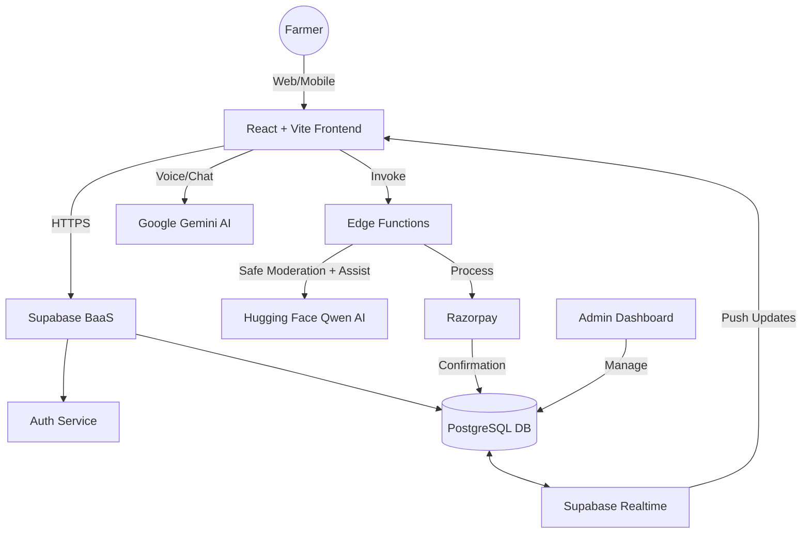

<div align="center">
  <a href="https://github.com/Neerajkumar151/KrishiSanjivni">
    
  </a>

  <h1 align="center">🌱 KrishiSanjivni</h1>

  <p align="center">
    <strong>Empowering Farmers with Digital Intelligence & AI</strong>
    <br />
    A comprehensive smart farming platform for soil testing, equipment rentals, real-time insights, and community connection.
    <br />
    <br />
    <a href="https://www.krishisanjivni.me/"><strong>Visit Website »</strong></a>
    <br />
    <br />
    <a href="https://github.com/Neerajkumar151/KrishiSanjivni/issues">Report Bug</a>
    ·
    <a href="https://github.com/Neerajkumar151/KrishiSanjivni/issues">Request Feature</a>
  </p>
</div>

<div align="center">
  
  
  
  
</div>

---

<details>
  <summary><strong>📖 Table of Contents</strong></summary>
  <ol>
    <li><a href="#-overview">Overview</a></li>
    <li><a href="#-tech-stack">Tech Stack</a></li>
    <li><a href="#-video-demo">Video Demo</a></li>
    <li><a href="#-screenshots">Screenshots</a></li>
    <li><a href="#-system-architecture">System Architecture</a></li>
    <li><a href="#-key-features">Key Features</a></li>
    <li><a href="#-getting-started">Getting Started</a></li>
    <li><a href="#-project-structure">Project Structure</a></li>
    <li><a href="#-recent-updates">Recent Updates</a></li>
    <li><a href="#-future-roadmap">Future Roadmap</a></li>
    <li><a href="#-contact">Contact</a></li>
  </ol>
</details>

---

## 🚀 Overview

**KrishiSanjivni** (formerly Farmhive) is a digital ecosystem designed to bridge the gap between traditional farming and modern technology. By integrating AI, real-time data, and e-commerce, we aim to reduce manual effort and improve decision-making for farmers across India.

### 🎯 Goal
To democratize access to agricultural services—from soil testing to equipment rentals—in a language the farmer understands.

---

## 🛠 Tech Stack

The project is built using a modern, scalable architecture.

| Component | Technologies |
| :--- | :--- |
| **Frontend** |     |
| **UI Components** | Radix UI, Shadcn/UI, Lucide React, Recharts |
| **Backend / DB** |  (Auth, PostgREST, Realtime, Migrations) |
| **AI / ML** |  (Qwen2.5-72B-Instruct)  |
| **Payments** |  |
| **Security** | AI Content Moderation, Regex-based Safety Layers, Secure .gitignore |
| **Localization** | i18next (Hindi, English, Tamil, Telugu, Bengali) |

---

## 🎥 Video Demo

Click below to watch a complete walkthrough of the platform in action:

[](https://krishisanjivni.me/)

---

## 📸 Screenshots

<table>
  <tr>
    <td align="center" width="50%">
      
      <br><strong>🏠 Landing Page</strong>
    </td>
    <td align="center" width="50%">
      
      <br><strong>👤 User Profile & Avatars</strong>
    </td>
  </tr>
  <tr>
    <td align="center" width="50%">
      
      <br><strong>🚜 Equipment Rental</strong>
    </td>
    <td align="center" width="50%">
      
      <br><strong>🤖 AI Chatbot (Voice Enabled)</strong>
    </td>
  </tr>
  
  <tr>
    <td align="center" width="50%">
      
      <br><strong>💹 Real-time Mandi Prices</strong>
    </td>
    <td align="center" width="50%">
      
      <br><strong>🛡️ Responsive Admin Suite</strong>
    </td>
  </tr>
  <tr>
    <td align="center" width="50%">
      
      <br><strong>👥 Community Group Chat</strong>
    </td>
    <td align="center" width="50%">
      
      <br><strong>🏪 Warehouse Management</strong>
    </td>
  </tr>
</table>

---

## 🏗 System Architecture

We utilize a serverless architecture powered by Supabase Edge Functions and Realtime to ensure scalability and instant updates.


```mermaid
graph TD
    User((Farmer))
    Frontend[React + Vite Frontend]
    Supabase[Supabase BaaS]
    Auth[Auth Service]
    DB[(PostgreSQL DB)]
    Realtime[Supabase Realtime]
    Edge[Edge Functions]
    AI_HF[Hugging Face Qwen AI]
    AI_Gemini[Google Gemini AI]
    Pay[Razorpay]
    Admin[Admin Dashboard]

    User -->|Web/Mobile| Frontend
    Frontend -->|HTTPS| Supabase
    Supabase --> Auth
    Supabase --> DB
    DB <--> Realtime
    Realtime -->|Push Updates| Frontend
    
    Frontend -->|Invoke| Edge
    Edge -->|Process| Pay
    Edge -->|Safe Moderation + Assist| AI_HF
    Frontend -->|Voice/Chat| AI_Gemini
    
    Pay -->|Confirmation| DB
    Admin -->|Manage| DB
```
---

## ✨ Key Features

### 1. 🌾 Smart Farming Services
- **Soil & Crop Analysis**: Submit soil requests digitally; track expert recommendations and PH levels.
- **Expert Consultations**: Admins provide tailored crop advice directly through the portal.

### 2. 🚜 Resource Management
- **Equipment Rental**: Browse high-tech farming tools, book via an interactive calendar, and pay securely.
- **Warehouse Booking**: Real-time slot management for crop storage with availability tracking.

### 3. 🧠 AI & Intelligence
- **KrishiSanjivni AI Assistant**: Dedicated community assistant that automatically helps with farming questions.
- **Smart Trigger Logic**: AI stays silent for out-of-scope clutter but provides the user's language mirroring (Hindi/Hinglish) when called.
- **Real-time Moderation**: Instant AI-powered safety layer using Qwen2.5-72B to keep the community safe.
- **Multilingual Support**: Supports Voice-to-Text and Text-to-Speech for easy accessibility.
- **Market Intel**: Live Mandi prices and local commodity trends.
- **Weather Insights**: Hyper-local forecasts for better planting schedules.

### 4. 💬 Communication & Community
- **Real-time Chat**: Private messaging between users and admins with unread indicators.
- **Broadcast System**: Platform-wide announcements sent instantly to all users via a unified dashboard.
- **User Profiles**: Custom profiles with avatar uploads (Base64) and instant UI updates.

### 5. 📱 Responsive Admin Suite
- **Mobile-First Design**: Sliding navigation drawers and "Hamburger" menus for on-the-go management.
- **Master-Detail Messaging**: Optimized chat interface for small screens (iPhone/Android).
- **Independent Scrolling**: Advanced CSS layout ensuring smooth navigation within specific panels.

---

## ⚡ Getting Started

Follow these steps to run the project locally.

### 1. Clone the Repository
```bash
git clone https://github.com/Neerajkumar151/KrishiSanjivni.git
cd KrishiSanjivni
```
### 2. Install Dependencies
```bash
npm install
```
### 3. Configure Environment
Create a `.env` file in the root directory:
```bash
VITE_SUPABASE_URL=your_supabase_url
VITE_SUPABASE_ANON_KEY=your_supabase_anon_key
VITE_RAZORPAY_KEY=your_razorpay_key_id
VITE_GEMINI_KEY=your_google_genai_key
```
### 4. Run the App
```bash
npm run dev
```

---

## 📂 Project Structure
```bash
KrishiSanjivni
│── public
│   ├── locales (translations)
│   ├── assets (images/demo)
│   └── logo.webp
│
│── src
│   ├── components
│   │   ├── chat/ (Private messaging & Broadcast)
│   │   ├── ui/ (Shadcn components)
│   │   └── Layout.tsx
│   │
│   ├── pages
│   │   ├── admin/ (Dashboard, User Mgmt, Warehouse Mgmt)
│   │   ├── profile/ (User Profile & Avatars)
│   │   ├── CommunityPage.tsx
│   │   └── MarketPrices.tsx
│   │
│   ├── contexts/ (Auth & Realtime state)
│   └── hooks/ (Admin & Data fetching)
│
│── supabase (Migrations & Edge Functions)
│── .gitignore (Secure patterns for private infra)
│── tailwind.config.ts
└── vite.config.ts
```

---

## 📈 Recent Updates
- **Community AI Overhaul**: Migrated to Hugging Face Inference API with Qwen2.5-72B for 2x faster moderation and expert farming advice.
- **API Economy**: Joint moderation/assistance calls reduced API token usage by ~50%.
- **Zero-Tolerance Safety**: Expanded safety categories (Scams, Self-harm, Threats) for bulletproof community protection.
- **Branding**: Custom moon-themed AI identity for the assistant.
- **Infrastructure Privacy**: Robust `.gitignore` hiding all Supabase migrations and sensitive config files.

---

## 🗺️ Future Roadmap
- [ ] IoT-based automated farm sensors.
- [ ] Drone-based crop disease imagery analysis.
- [ ] Offline-first mode for low-connectivity rural areas.
- [ ] Automated SMS billing and alerts.

---

## 🤝 Contact
**Neeraj Kumar** - G.L. Bajaj Institute of Technology and Management

📧 Email: [thakurneerajkumar17@gmail.com](mailto:thakurneerajkumar17@gmail.com)
🔗 LinkedIn: [linkedin.com/in/neerajkumar1517](https://www.linkedin.com/in/neerajkumar1517/)

---

## 📄 License
This project is licensed under MIT - see the [LICENSE](LICENSE) file for details.

---
**Give a ⭐️ if this project helped you!**
